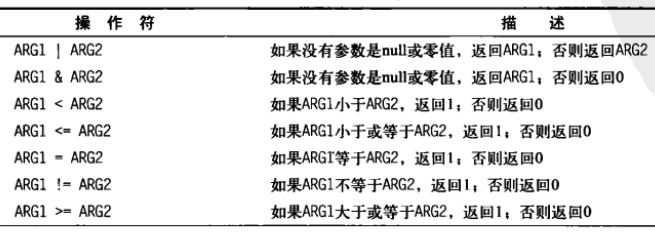
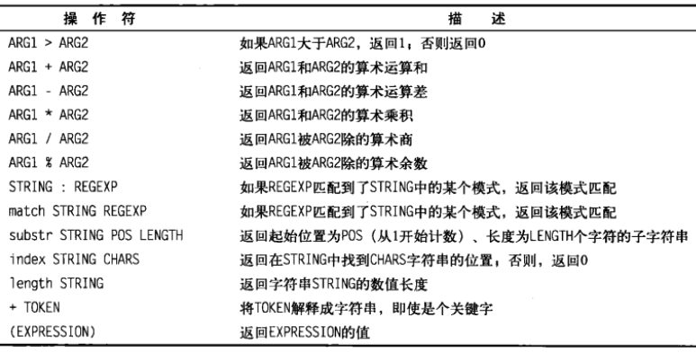

# Shell 数学运算

## expr 命令

* expr 命令允许在命令行上处理数学表达式

```bash
expr 1 + 5
```





* 尽管标准操作符在 expr 命令中工作得很好, 但在脚本或命令行上使用它们时就会有问题, 因为许多 expr 命令操作符在 shell 中有其他意思. 可以进行转义

```bash
# 操作数和运算符之间必须要有空格
expr 5 \* 2
```

## 使用方括号

* 在 bash 中, 在将一个数学运算结果赋给某个变量时, 可以用美元符合方括号( $[ operation ] )将数学表达式圈起来
* 这比使用 expr 命令方便很多, 方括号里面的字符不会认为是 shell 中的特殊字符
* bash 只支持整数运算. zsh 提供了完整的浮点运算

```bash
var1=$[1 + 5]
```

## 浮点解决方案

### bc

* bash 计算器允许你在命令行输入浮点表达式、解释表达式、计算并返回结果的一种编程语言.
* bash 计算器能够识别:
  * 数字(整数和浮点数)
  * 变量(简单变量和数组)
  * 注释(#、/* */)
  * 表达式
  * 编程语句(if-then等)
  * 函数

```bash
# 启动
bc
bc -q
# 进入 bc 后, 定义的变量可以在整个 bc 会话中使用, 不能再 shell 脚本中使用
# print 语句允许你打印变量和数字
# 退出
quit
```

* 浮点运算由一个内建的 scale 变量控制精确度

```bash
# 保留 4 位小数, scale 默认是 0
scale=4
```

### 在脚本中使用 bc

```bash
# 基本格式
# options : 设置变量
# expression : bc 执行的数学表达式
variable=`echo "options; expression" | bc`
```

```bash
# bc 能识别输入重定向
# 使用 内联输入重定向 最为方便
variable=`bc << EOF
options
statements
expressions
EOF
`
```
